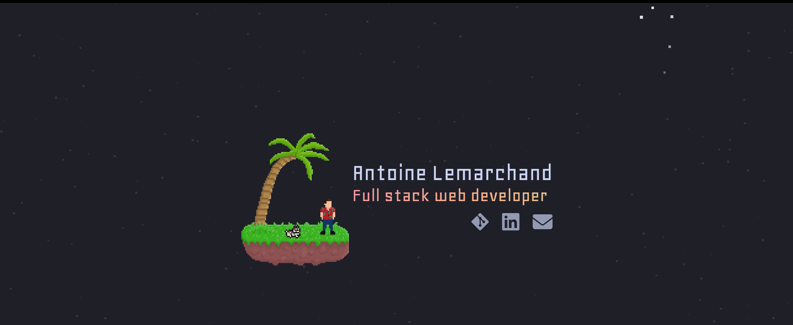

# 🚀 Space Portfolio

## Description
A **Next.js** portfolio website with a **space-themed design**.  
Showcases projects, skills, and personal achievements with interactive elements and smooth animations.


---

## ✨ Features
- Responsive layout for desktop and mobile  
- Space-themed animations and effects  
- Project showcase with interactive cards  
- Smooth scrolling and section navigation  
- Contact form integration  

---

## 🚀 Quick Start

### Prerequisites
- [Node.js](https://nodejs.org/) (v18+ recommended)
- [Yarn](https://yarnpkg.com/) or npm

### Installation
```bash
# Clone the repository
git clone https://github.com/your-username/space-portfolio.git
cd space-portfolio

# Install dependencies
yarn install   # or npm install

# Run development server
yarn dev       # or npm run dev
